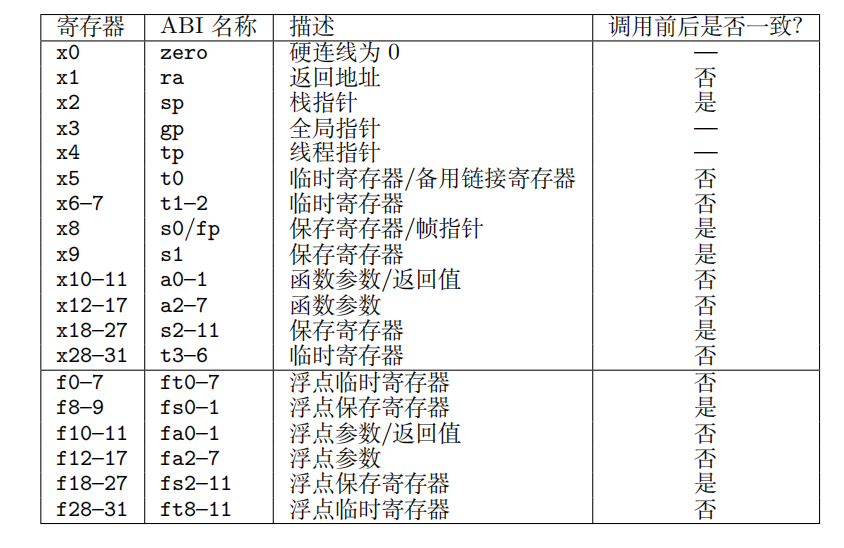

约定寄存器编号:
0-31 通用物理寄存器
32-63 浮点物理寄存器
64-.. 虚拟寄存器

caller_save寄存器,除了ra以外的调用前后不一致的寄存器
callee_save寄存器,除了sp以外的保证调用前后一致的寄存器

caller_save寄存器包括:
- t0-t6 ;7
- a0-a7 ; 8
- ft0-ft11 ;12
- fa0-fa7 ;8
总共35个
callee_save寄存器包括:
- s0-s11; 12
- fs0-fs11 ;12
总共24个
